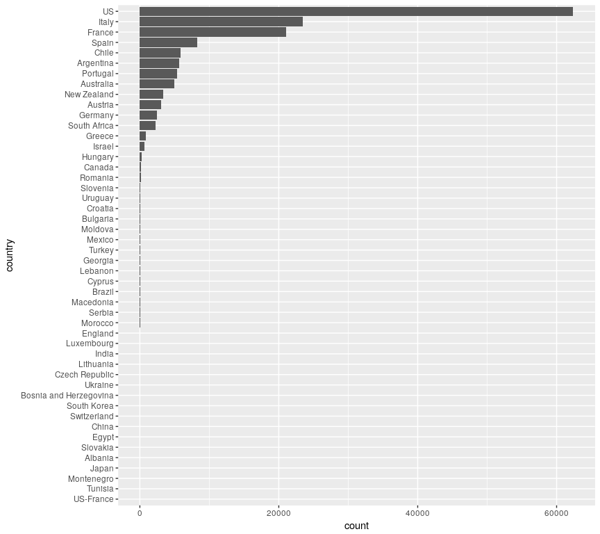
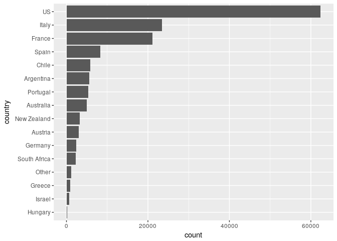
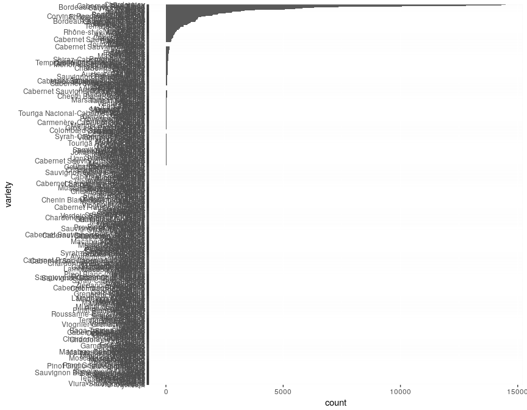
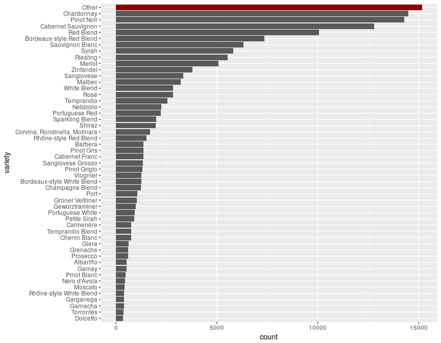
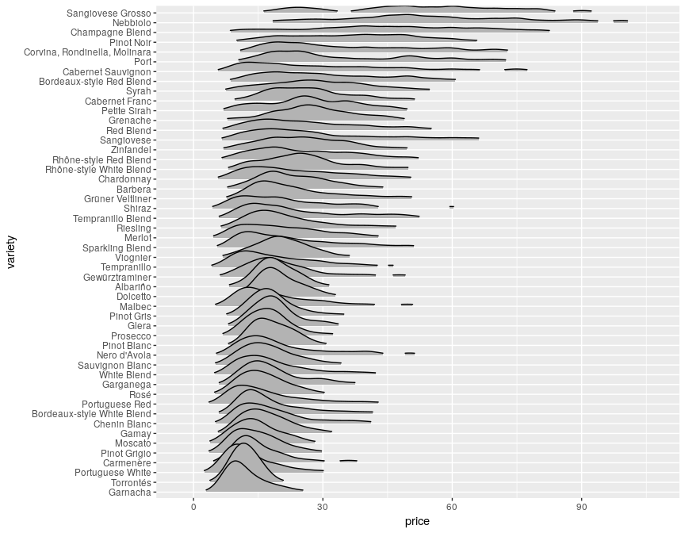
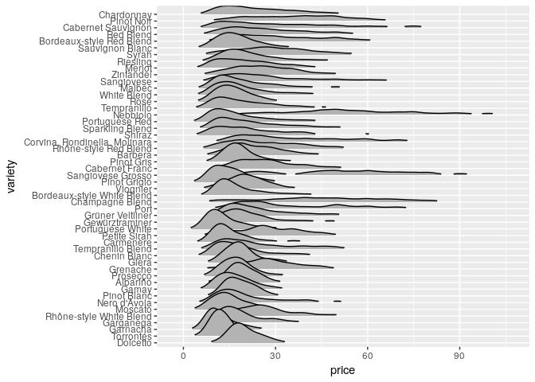
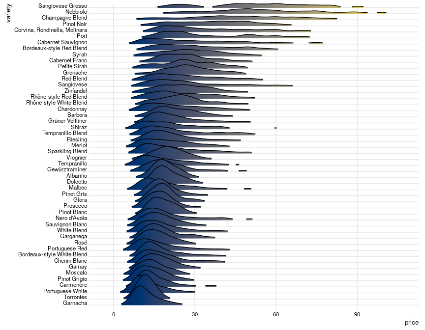

# Joy plots with Wine
Often, I find a nice visualization somewhere, in some journal or a tweet, that I like so much that I want to introduce it to my plotting repetoir. The ridgeline plot is one that I've already seen a few times but only know came around to use it. The ridgeline plot is also called joy plot, an hommage to the band Joy Division. The cover of their album "Unknown pleasure" stood inspiration for this visualization.
I find the plot especially useful to compare distribution of a categorical variable with many levels. In R, the plot is very easy to create, thanks to the package `ggridges`.

## A short look at the data
Let's first load in the data. You can download the data from kaggle via their API using the following command:
```
kaggle datasets download -d zynicide/wine-reviews
```
If you haven't used their API yet, a description how to set it up can be found [here](https://github.com/Kaggle/kaggle-api).


```r
library(tidyverse)
wine <- read_csv("~/.kaggle/datasets/zynicide/wine-reviews/winemag-data_first150k.csv")
wine$X1 <- NULL
wine <- wine %>% mutate_at( c("country", "province", "region_1", "region_2", "variety", "winery"), factor)
summary(wine)
```

```
##     country      description        designation            points      
##  US     :62397   Length:150930      Length:150930      Min.   : 80.00  
##  Italy  :23478   Class :character   Class :character   1st Qu.: 86.00  
##  France :21098   Mode  :character   Mode  :character   Median : 88.00  
##  Spain  : 8268                                         Mean   : 87.89  
##  Chile  : 5816                                         3rd Qu.: 90.00  
##  (Other):29868                                         Max.   :100.00  
##  NA's   :    5                                                         
##      price                   province                     region_1     
##  Min.   :   4.00   California    :44508   Napa Valley         :  6209  
##  1st Qu.:  16.00   Washington    : 9750   Columbia Valley (WA):  4975  
##  Median :  24.00   Tuscany       : 7281   Mendoza             :  3586  
##  Mean   :  33.13   Bordeaux      : 6111   Russian River Valley:  3571  
##  3rd Qu.:  40.00   Northern Spain: 4892   California          :  3462  
##  Max.   :2300.00   (Other)       :78383   (Other)             :104067  
##  NA's   :13695     NA's          :    5   NA's                : 25060  
##              region_2                         variety     
##  Central Coast   :13057   Chardonnay              :14482  
##  Sonoma          :11258   Pinot Noir              :14291  
##  Columbia Valley : 9157   Cabernet Sauvignon      :12800  
##  Napa            : 8801   Red Blend               :10062  
##  California Other: 3516   Bordeaux-style Red Blend: 7347  
##  (Other)         :15164   Sauvignon Blanc         : 6320  
##  NA's            :89977   (Other)                 :85628  
##                    winery      
##  Williams Selyem      :   374  
##  Testarossa           :   274  
##  DFJ Vinhos           :   258  
##  Chateau Ste. Michelle:   225  
##  Columbia Crest       :   217  
##  Concha y Toro        :   216  
##  (Other)              :149366
```
We have two numerical variables, `points` and `price`, and a few character and categorical variables.
We first have a look at the countries.

```r
wine %>% select(country) %>% na.omit() %>%
  mutate(country =  fct_infreq(country) %>% fct_rev() ) %>% 
  ggplot(aes(x=country)) + geom_bar() +  coord_flip() 
```

<!-- -->

There is quite a bunch of countries, but most of them seem to have only few observations. It would be reasonable to only plot the most common countries.

## Factoring for nice plots
When learning about ridgeplots, I stumbled upon the package `forcats` and it is super useful for nice plots. The package is a collection of tools to deal with factors. One quite often wants to order some factor variable in a certain way to make a plot aesthetically more pleasing but this becomes unpractical to do by hand if a factor variable has many levels. This is where `forcats` shines. In the example above for example, `fct_infreq()` orders the countries by their frequency (most common first) and `fct_rev()` then reverses this order (this is necessary because I did a coordinate flip). If we now want to plot only the 15 most common countries (and lump everything else together into "Other"), `forcats` has a function for that:


```r
wine %>% select(country) %>% na.omit() %>%
  mutate(country = fct_lump(country, n=15) %>% fct_infreq() %>% fct_rev() ) %>%
  ggplot(aes(x=country)) + geom_bar() + coord_flip()
```

<!-- -->

So most of the wine comes from the US, Italy, and France. 
Next, let's look how many wine varieties there are:


```r
wine %>% mutate(variety = fct_infreq(variety) %>% fct_rev() ) %>%
  ggplot(aes(x=variety)) + geom_bar() + coord_flip()
```

<!-- -->

There are way too many varieties! As before, we use `fct_lump()` to get only the most common varieties. This time, we use the 50 most common ones. To better see, how many levels we lumped together into "Other", I also highlight them.

```r
wine_fct <- wine %>% 
  mutate(variety = fct_lump(variety, n=50) %>% fct_infreq() %>% fct_rev() )
wine_flt <- wine_fct %>% filter(variety == "Other")

ggplot(wine_fct, aes(x=variety)) + geom_bar() + coord_flip() +
  geom_bar(fill="darkred", data=wine_flt)
```

<!-- -->

This plot looks more reasonable. It is still a bit difficult to read, so one might consider lump even more small categories together. Since "Other" is already the largest category, I will leave it like this for.

## The Joy plots
One of the first questions that came to my mind, is if some varieties are more expensive than others. Now this is a task where I find ridgeplots very useful. We have quite many varieties and for each of them there is a distribution for their price. The ridgeplot stacks these distribution on top of each other, creating some overlap. You do lose some information this way but you can get a good overview.
I cut off the price at 100 (I assume \$) since the plot otherwise skews very heavily, it seems some wines sell for a few thousand dollars. I also remove the level "Other" for this plot.

```r
library(ggridges)
# which variety has the highest price?
wine_fct %>% select(variety, price) %>%
  filter(price <= 100 & variety != "Other") %>%
  mutate(variety = fct_reorder(variety, price, .fun = median)) %>%
  ggplot(aes(x=price, y=variety)) + geom_density_ridges(rel_min_height=0.05, scale=4) 
```

```
## Picking joint bandwidth of 2.37
```

<!-- -->

The `scale` parameter in `geom_density_ridges()` determines how stacked the distributions are. For `scale=1`, the maximum point of one density would just touch the baseline of the density above. Thus, the higher this number, the more overlap you have but more densities fit on top of each other.

Notice also the use of `fct_reorder()`: it sorts the variety levels by the median of their price (in ascending order). For comparison, see below without the ordering. Not only does it look more chaotic, but it is also harder to see which variety actually has the higher prices.


```r
wine_fct %>% select(variety, price) %>%
  filter(price <= 100 & variety != "Other") %>%
  ggplot(aes(x=price, y=variety)) + geom_density_ridges(rel_min_height=0.05, scale=4) 
```

```
## Picking joint bandwidth of 2.37
```

<!-- -->


The ridgeplot package also kindly provides a theme that makes ridgeline plots look better. Look better might be subjective though, I had a use case where it looked better without the theme.
To get the plots nicely colored, the package also provides a function for improved coloring of the densities. `geom_density_ridges_gradient()` allows for color changes along the x axis. It works well with the package `viridis`. Check out this nice looking plot:

```r
library(viridis)
# which variety has the highest price?
wine_fct %>% select(variety, price) %>%
  filter(price <= 100 & variety != "Other") %>%
  mutate(variety = fct_reorder(variety, price)) %>%
  ggplot(aes(x=price, y=variety, fill=..x..)) + geom_density_ridges_gradient(rel_min_height=0.05, scale=4) +
  scale_fill_viridis(option="E")  + 
  theme_ridges(font_size = 10) + theme(legend.position = "none")
```

<!-- -->

Almost ready to put on an album cover!
