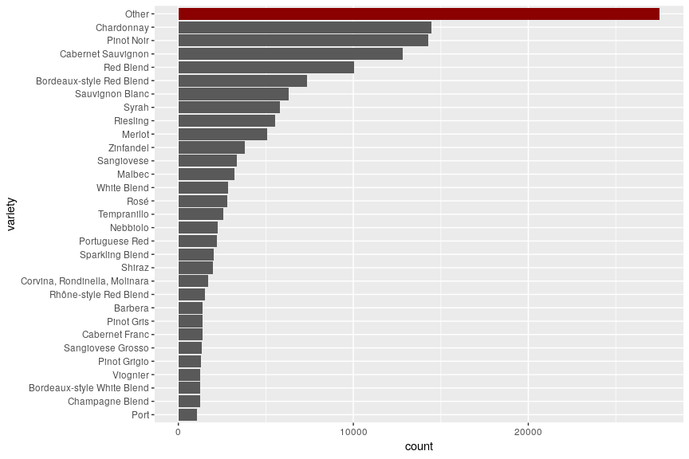

# Fun with ridgeline plots and wine
Often, I find a nice visualization somewhere, in some journal or a tweet, that I like so much that I want to introduce it to my plotting repertoire. The ridgeline plot is one that I've already seen a few times but only now came around to use it. 

The ridgeline plot have also been called joy plot, an homage to the band Joy Division. The cover of their album "Unknown pleasure" stood inspiration for this visualization. (However, I found out that given [the unfortunate origin](https://en.wikipedia.org/wiki/House_of_Dolls) of the name Joy Division, the term "joy plot" is now discouraged.)

I find the plot especially useful to compare continuous distributions in relation to a categorical variable with many levels. 
In R, the plot is very easy to create, thanks to the package `ggridges` by Claus Wilke ([link](https://github.com/clauswilke/ggridges)).

## A short look at the data
In this post, I'll be using a data set containing wine reviews. It contains a wide range of different wines, where they come from, which grape variety it is together with the point review and its price. You can download the data from kaggle via their API using the following command:
```
kaggle datasets download -d zynicide/wine-reviews
```
If you haven't used their API yet, a description how to set it up can be found [here](https://github.com/Kaggle/kaggle-api).


```r
library(tidyverse)
wine <- read_csv("~/.kaggle/datasets/zynicide/wine-reviews/winemag-data_first150k.csv")
wine$X1 <- NULL
wine <- wine %>% mutate_at( c("country", "variety"), factor)
wine %>% select(country, variety, price) %>% summary()
```

```
    country                          variety          price        
 US     :62397   Chardonnay              :14482   Min.   :   4.00  
 Italy  :23478   Pinot Noir              :14291   1st Qu.:  16.00  
 France :21098   Cabernet Sauvignon      :12800   Median :  24.00  
 Spain  : 8268   Red Blend               :10062   Mean   :  33.13  
 Chile  : 5816   Bordeaux-style Red Blend: 7347   3rd Qu.:  40.00  
 (Other):29868   Sauvignon Blanc         : 6320   Max.   :2300.00  
 NA's   :    5   (Other)                 :85628   NA's   :13695    
```
In this post, I'll concentrate only on these three variables: `country`, `variety`, and `price`. The first two are both categorical variables with many levels and `price` is continous.
We first have a look at the countries.

```r
wine %>%
  select(country) %>%
  na.omit() %>%
  mutate(country = fct_infreq(country) %>% fct_rev()) %>%
  ggplot(aes(x = country)) + geom_bar() + coord_flip()
```

<!-- -->

There is quite a bunch of countries, but most of them seem to have only few observations. Due to the long list of countries, the names are a bit squeezed, which makes it hard to read and not very aesthetically pleasing. It would be reasonable to only plot the most common countries.

## Factoring for nice plots
When learning about ridge plots, I stumbled upon the package `forcats` and it is super useful for nice plots. The package is a collection of tools to deal with factors. Quite often it's necessary to order some factor variable in a certain way to make a plot aesthetically more pleasing but this becomes unpractical to do by hand if a factor variable has many levels. This is where `forcats` shines. In the example above for example, `fct_infreq()` orders the countries by their frequency (most common first) and `fct_rev()` then reverses this order (this is necessary because I did a coordinate flip). If we now want to plot only the 15 most common countries (and lump everything else together into "Other"), we can use the function `fct_lump()`:


```r
wine %>%
  select(country) %>%
  na.omit() %>%
  mutate(country = fct_lump(country, n = 15) %>% fct_infreq() %>% fct_rev()) %>%
  ggplot(aes(x = country)) + geom_bar() + coord_flip()
```

<!-- -->

So most of the wine in this data set comes from the US, Italy, and France. 
Next, let's look how many wine varieties there are:


```r
wine %>%
  mutate(variety = fct_infreq(variety) %>% fct_rev()) %>%
  ggplot(aes(x = variety)) + geom_bar() + coord_flip()
```

<!-- -->

There are way too many varieties! This way, the plot is pretty much useless. As before, we use `fct_lump()` to get only the most common varieties. This time, we use the 30 most common ones. To better see, how many observations we lumped together into "Other", I also highlight them.

```r
wine_fct <- wine %>%
  mutate(variety = fct_lump(variety, n = 30) %>% fct_infreq() %>% fct_rev())
# create data frame that only contains the observations to highlight
wine_flt <- wine_fct %>% filter(variety == "Other")

ggplot(wine_fct, aes(x = variety)) + geom_bar() + coord_flip() +
  geom_bar(fill = "darkred", data = wine_flt)
```

<!-- -->

This plot looks more reasonable. It still has quite many varieties, so it is still not the clearest plot. One might consider to lump even more small categories together but since "Other" is already the largest category, I will leave it like this for now.

## The Joy plots
One of the first questions that came to my mind, is if some varieties are more expensive than others. Now this is a task where I find ridge plots very useful. We have quite many varieties and for each of them there is a distribution for their price. The ridge plot stacks these distribution on top of each other, creating some overlap. You do lose some information this way but you can get a good overview.
I cut off the price at 100 (I assume price is in \$) since the plot otherwise skews very heavily, it seems some wines sell for a few thousand dollars. I also remove the level "Other" for this plot.

```r
library(ggridges)
# which variety has the highest price?
wine_fct %>%
  select(variety, price) %>%
  filter(variety != "Other") %>%
  mutate(variety = fct_reorder(variety, price, .fun = median, na.rm = T)) %>%
  ggplot(aes(x = price, y = variety)) +
    geom_density_ridges(rel_min_height = 0.05, scale = 3.5) +
    xlim(0, 100)
```

<!-- -->

The `scale` parameter in `geom_density_ridges()` determines how stacked the distributions are. For `scale=1`, the maximum point of one density would just touch the baseline of the density above. Thus, the higher this number, the more overlap you have but more densities fit on top of each other.

Notice also the use of `fct_reorder()`: it sorts the variety levels by the median of their price (in ascending order). For comparison, see below without the ordering. Not only does it look more chaotic, but it is also harder to see which variety actually has the higher prices.


```r
wine_fct %>% select(variety, price) %>%
  filter( variety != "Other") %>%
  ggplot(aes(x=price, y=variety)) + 
    geom_density_ridges(rel_min_height=0.05, scale=3.5) +
    xlim(0, 100)
```

<!-- -->

The ridge plot package also kindly provides a theme that makes ridgeline plots look better. Looking better can be subjective though, I had a use case where I found it looked better without the theme.
To get the plots nicely colored, the package also provides a function for improved coloring of the densities. `geom_density_ridges_gradient()` allows for color changes along the x-axis. Check out this nice looking plot:

```r
wine_fct %>%
  select(variety, price) %>%
  filter( variety != "Other") %>%
  mutate(variety = fct_reorder(variety, price, .fun = median, na.rm = T)) %>%
  ggplot(aes(x = price, y = variety, fill = ..x..)) + 
    geom_density_ridges_gradient(rel_min_height = 0.05, scale = 3.5) +
    scale_fill_gradient(low = "#600229", high = "#fcc5cd") +
    theme_ridges(font_size = 12) + 
    theme(legend.position = "none") +
    xlim(0, 100) + labs(x="Price", y="Variety")
```

<!-- -->

Almost ready to put on an album cover!
