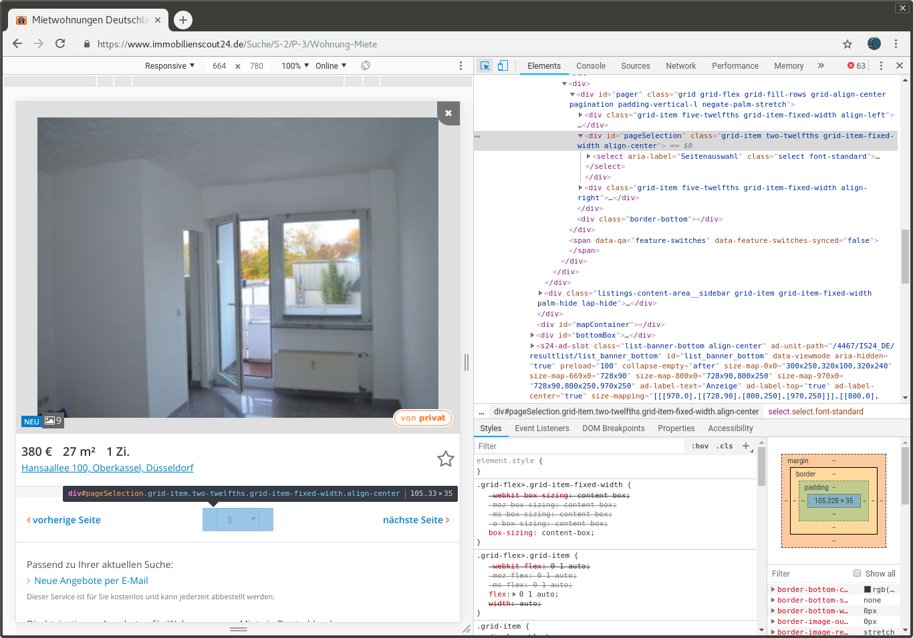

```{r setup, include=FALSE}
knitr::opts_chunk$set(echo = TRUE)
```
Berlin is a great city that used to have the reputation of affordable rents. While for sure there are still other cities much more expensive, the rents in Berlin have raised considerably. Or so says everyone of my friends and my colleagues and so does it feel looking at renting listings. But let's try to put some data to these feelings and maybe find out in the mean time if there's still a secret neighborhood in Berlin resisting the raising prices and who knows, maybe the data can even tell us if the neighborhood Wedding is indeed "coming".

For this, I will scrape the web page [Immoscout](https://www.immobilienscout24.de) for rental flats. It is the biggest plattform offering not just for rental housing but also for real estate. In this atricle, I will concentrate on the rental offers, I don't yet feel like buying a house.
```{r}
url <- "https://www.immobilienscout24.de/Suche/S-2/Wohnung-Miete"
```

For scraping, we will use the library `rvest`.
```{r, message=FALSE}
library(tidyverse)
library(rvest)         # for scraping
library(stringr)       # for string manipulation
library(glue)          # evaluate expressions in strings
library(jsonlite)      # to handle json data
```

Now if we look at the URL, then it has a list of offers and at the bottom, we can select the page via drop down menu or go to the previous or next page.
Our task will now be to iterate over all pages and get all listings from each page. For this, we will need to look at some HTML and CSS code.
The easiest way to do is, is to have a look at the source code in your browser (if you use Chrome, just press `F12`). If you then hover over the elements, you can see the corresponding source code. Since we want to know, how many pages of listings there are, we have a look at the drop down menu at the bottom:


If you know a bit of HTML, then you know that `<div>` represents an HTML node for a division or section. Other HTML nodes are for example

- `<h1>`, `<h2>` etc for headings
- `<p>` are paragraph elements
- `<ul>` is an unordered list (such as this one) where each item is denoted with `<li>`
- `<ol>` is an orderd list
- `<table>` is a table (surprise)

The ususal structure in an HTML file is such, that the tag for a node embraces its content: `<tag>content</tag>`. 
To access any HTML node, we can use the function `html_nodes()`. First, we load in the first page and can then access any HTML node as follow:

```{r}
first_page <- read_html(url)
first_page %>%
  html_nodes("div") %>%
  head
```

We're not actually interested in all divisions but only the one with the ID `"pageSelection"`. To get this specific node, we use `#` to denote that it's an ID. In this division, there is a select node which contains all options. We can access the nested nodes as follows:
```{r}
first_page %>%
  html_nodes("#pageSelection  > select > option") %>%
  head
```

From this, it is now very easy to obtain the last page number. With `html_text()`, we extract the values for each node as text, which gives us then a vector of page numbers. The length of this vector is then the number of pages:

```{r}
( last_page_number <- first_page %>%
              html_nodes("#pageSelection > select > option") %>%
              html_text %>%
              length )
```

As next step, we can generate a list that contains the URLs of each page. At this website, the page number is inserted somewhere in the middle of the URL for which we will take advantage of the package glue, which evaluates expressions in curly braces in strings:
```{r}
page_url <- "https://www.immobilienscout24.de/Suche/S-2/P-{pages}/Wohnung-Miete"
pages <- 1:last_page_number
page_list <- glue(page_url)
```

Now that we have a list for all pages, we need to find out how to actually get the information of each listing. Going back to the source code of the website, we see that the listings are contained in an unordered list (`<ul>`) with the ID `"resultListItems"` where each listing is a node with the tag `<li>`.
```{r}
first_page %>% 
  html_nodes("#resultListItems > li") %>%
  head
```
We now see that the first item in the list is not actually a listing but a banner. The listings are all of the class `result-list__listing`. To extract only the nodes of a certain class, we give the paramter `.class-name` to `html_nodes()`:
```{r}
first_page %>% 
  html_nodes(".result-list__listing") %>%
  head
```

Perfect, now we have a list of all listings.

We could now either just scrape the information for each listing that is displayed on the front page (such as total rent, number of rooms etc) or get the link to the listing and scrape the information from there. We will do the second option here.

Looking again at the source code, we find the following `<a href="/expose/123456">`. That means, the link is given as a relative path and has the same form for each listing. The number in the link is also given as `data-id` as attribute in the `<li>` node. The attributes of a node are not part of the node content (and hence are not output via `html_text()`). In `rvest`, we can get attributes using the function `xml_attr()`.
```{r}
(listing_ids <- first_page %>% html_nodes(".result-list__listing") %>%
  xml_attr("data-id") )
```

This gives us all the information we need to create a list of all listings:
```{r}
listing_url <- "https://www.immobilienscout24.de/expose/"
listing_list <- str_c(listing_url, listing_ids)
```

In the next step, we need to extract the relevant information from one flat listing. Again, we need to look at the source code. Rather hidden in the code is somewhere a dictionary called `keyValues` that contains all information about the flat in a compact format. Since it is actually in some javascript code, I found it easiest to just transform the whole page via `html_text()` to a string and then extract the dictionary with some regex. 

Let's do this exemplary for the first listing:
```{r}
list_page <- read_html(listing_list[1])
list_l <- list_page %>% 
  html_text %>%
  str_extract("(?<=keyValues = )(\\{.*?\\})") %>%
  str_remove_all("obj_") %>%    # to save some typing later on
  str_replace_all("false", "FALSE") %>%
  str_replace_all("true", "TRUE") %>%
  fromJSON  
```

If you wonder what the cryptic regex means, here is a very rough breakdown: The first group, that is the first parantheses, look for the pattern `"keyValues = "` and then match the group in the second parantheses. This is called a positive lookbehind. The second group then matches everything in curly braces. Since regex is something I can never quit remember for long, I usually just go to [this page](https://regex101.com/), copy paste the text in which I'm searching a certain pattern and then try until I find something that works. Unfortunately, the page only has a few regex flavors, but I found the python flavor to be close enough. One difference in R is, that to escape special characters, you need two backslashes instead of the usual one.

Back to the listings, there are two informations I would like to have that is not contained in the dictionary: The text description of the object and the text about the facilities. Luckily, there are much easier to find than the dictionary:
```{r}
list_l$description <- list_page %>%
  html_nodes(".is24qa-objektbeschreibung") %>%
  html_text 

list_l$facilities <- list_page %>%
  html_nodes(".is24qa-ausstattung") %>%
  html_text
```

For identifiability reasons, we should also add the ID of the listing itself. This way, we can later have a look at the listing page again.
```{r}
list_l$id <- listing_ids[1]
```

For further analysis, we can then transform the list to a data frame:
```{r}
list_df <- list_l %>% map_if(is_empty, function(x) {NA}) %>%
  as.tibble
```
Let's wrap this up in a little function:
```{r}
get_listing_data <- function(listing_url){
  list_page <- try(read_html(listing_url))
  if (any(class(list_page) == "try-error")) return(NULL)
  list_l <- list_page %>% 
    html_text %>%
    str_extract("(?<=keyValues = )(\\{.*?\\})") %>%
    str_remove_all("obj_") %>%    # to save some typing later on
    str_replace_all("false", "FALSE") %>%
    str_replace_all("true", "TRUE") %>%
    fromJSON  

  list_l$description <- list_page %>%
    html_nodes(".is24qa-objektbeschreibung") %>%
    html_text 

  list_l$facilities <- list_page %>%
    html_nodes(".is24qa-ausstattung") %>%
    html_text
  
  # extract id back from url
  list_l$id <- str_extract(listing_url, "(?<=/)\\d+")
  
  
  list_l %>% map_if(is_empty, function(x) {NA}) %>%
    as.tibble
}
```

The hard part is almost done. 
So far, we only have a single data point. We now need to piece everything together and loop over all pages and listings and scrape together the information.
```{r, eval=FALSE}
for (i in 1:last_page_number) {
  link <- page_list[i]
  page <- try(read_html(link))
  if (!any(class(page) == "try-error") ){
    listing_ids <- page %>% html_nodes(".result-list__listing") %>%
      xml_attr("data-id")
    listing_url <- "https://www.immobilienscout24.de/expose/"
    listing_list <- str_c(listing_url, listing_ids)
    
    map(listing_list, get_listing_data) %>%
      bind_rows() %>%
      write_csv(paste0("../../rohdaten/",format(Sys.time(), "%Y-%m-%d-%H%M%S"), " page ",i, ".csv" ) )
  }
}

```

